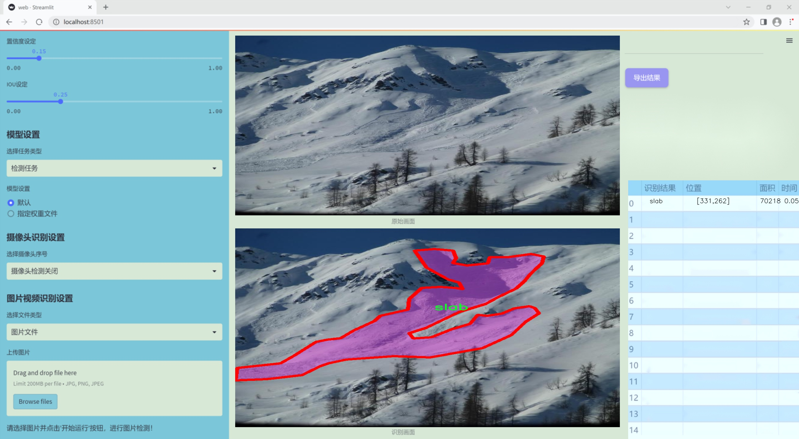
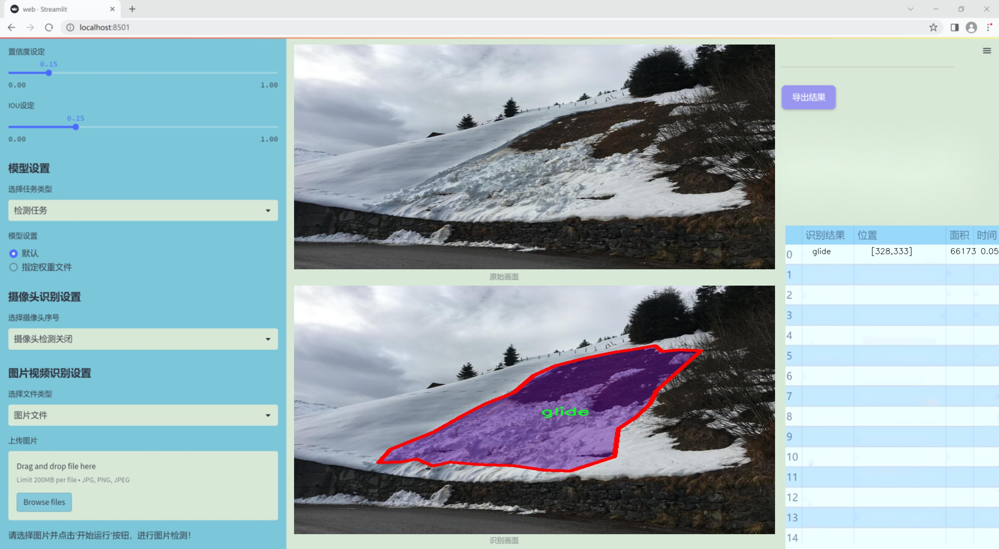
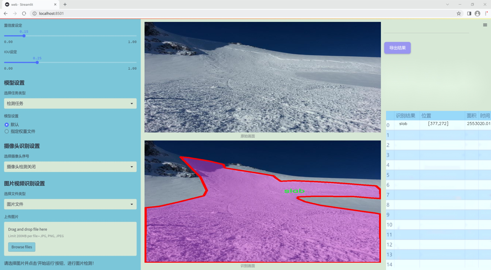
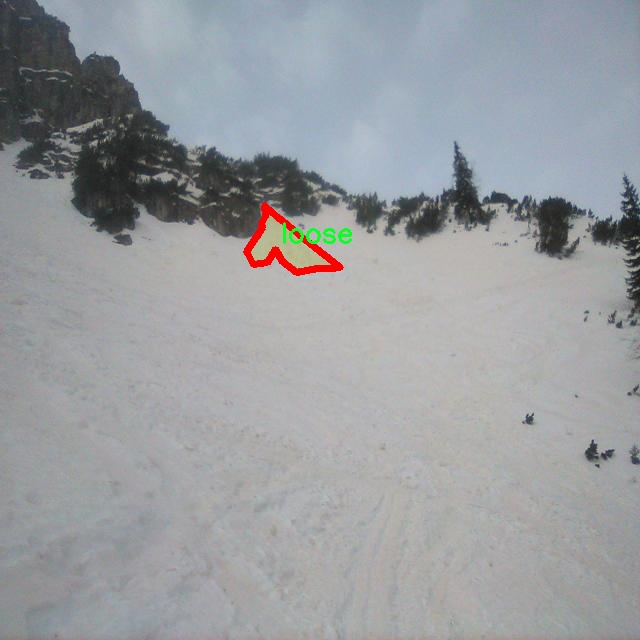
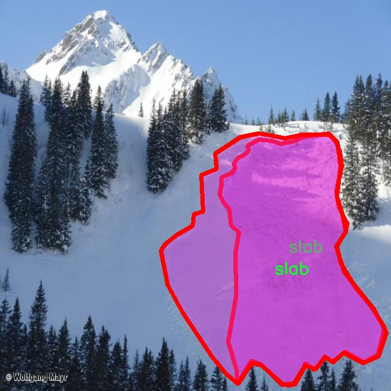
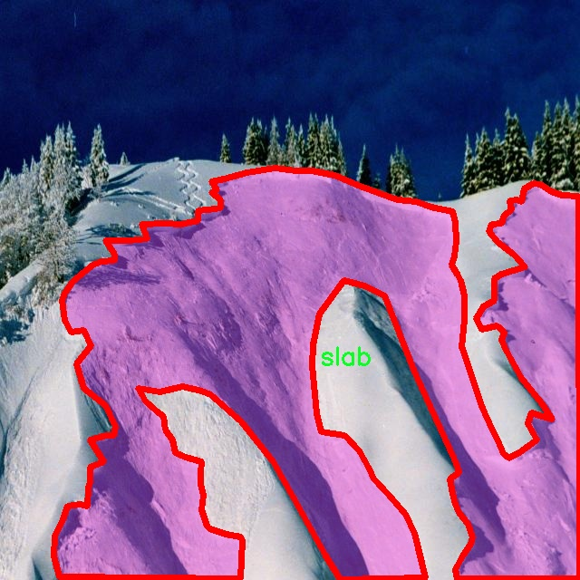
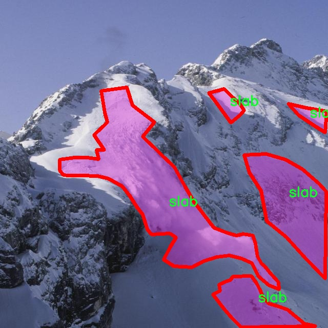
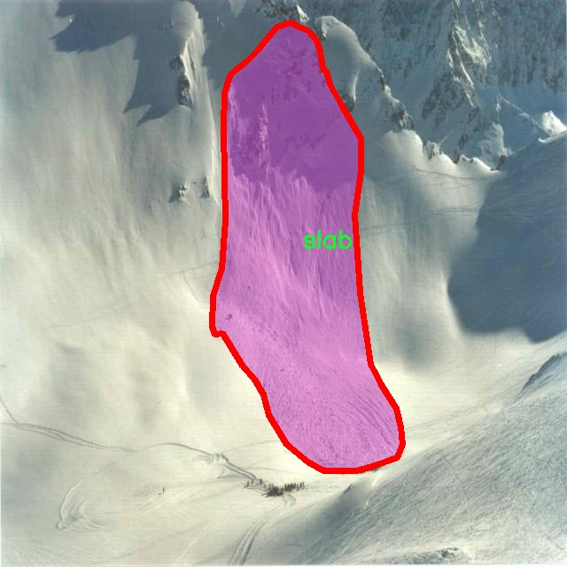

### 1.背景意义

研究背景与意义

雪崩作为一种自然灾害，常常对人类生命和财产安全造成严重威胁。随着全球气候变化的加剧，雪崩的发生频率和强度也在逐渐增加，尤其是在高山地区和滑雪场等人类活动频繁的区域。因此，及时、准确地检测和分类雪崩类型，成为了防灾减灾工作中的一项重要任务。传统的雪崩监测方法主要依赖于人工观察和气象数据分析，效率低下且容易受到人为因素的影响。随着计算机视觉技术的快速发展，基于深度学习的图像分割和目标检测方法逐渐成为雪崩监测的新兴手段。

本研究旨在基于改进的YOLOv11模型，构建一个高效的雪崩检测与分类图像分割系统。该系统将利用一个包含4100张图像的数据集，涵盖三种雪崩类型：滑动雪崩（glide）、松散雪崩（loose）和板状雪崩（slab）。通过对这些图像进行实例分割，系统能够精确识别不同类型的雪崩，并为后续的风险评估和应急响应提供科学依据。

改进YOLOv11模型的引入，旨在提升检测精度和处理速度，使其能够在复杂的自然环境中实时运行。此外，利用实例分割技术，可以更好地理解雪崩的形态特征及其对周围环境的影响，从而为雪崩的预警和管理提供更为详尽的信息。这一研究不仅具有重要的理论意义，还有助于推动雪崩监测技术的进步，进而提高公众安全意识和应对能力，为减少雪崩带来的损失贡献力量。

### 2.视频效果

[2.1 视频效果](https://www.bilibili.com/video/BV1v5qVYhERe/)

### 3.图片效果







##### [项目涉及的源码数据来源链接](https://kdocs.cn/l/cszuIiCKVNis)**

注意：本项目提供训练的数据集和训练教程,由于版本持续更新,暂不提供权重文件（best.pt）,请按照6.训练教程进行训练后实现上图演示的效果。

### 4.数据集信息

##### 4.1 本项目数据集类别数＆类别名

nc: 3
names: ['glide', 'loose', 'slab']


该项目为【图像分割】数据集，请在【训练教程和Web端加载模型教程（第三步）】这一步的时候按照【图像分割】部分的教程来训练

##### 4.2 本项目数据集信息介绍

本项目数据集信息介绍

本项目旨在改进YOLOv11的雪崩检测与分类图像分割系统，为此我们构建了一个专门的数据集，名为“avalert”。该数据集专注于雪崩相关的图像数据，涵盖了三种主要类别，分别是“glide”（滑动雪崩）、“loose”（松散雪崩）和“slab”（板状雪崩）。这些类别的选择基于雪崩发生的不同机制和特征，旨在为系统提供多样化的训练样本，以提高其在实际应用中的准确性和鲁棒性。

在数据集的构建过程中，我们收集了大量的雪崩图像，这些图像来自于不同的地理区域和气候条件，以确保数据的多样性和代表性。每一类雪崩都有相应的标注，标注信息包括雪崩的类型、发生的环境以及相关的地理特征。这些信息不仅有助于模型的训练，还能为后续的分析提供丰富的背景资料。

数据集的规模经过精心设计，以确保模型能够有效学习到每种雪崩类型的特征。我们采用了高质量的图像采集技术，确保数据的清晰度和细节表现，以便于模型在进行图像分割时能够准确识别和分类不同类型的雪崩。此外，数据集还包含了多种场景下的雪崩图像，例如在不同光照条件、不同天气状态下的雪崩情景，这为模型的泛化能力提供了良好的基础。

通过使用“avalert”数据集，我们期望能够显著提升YOLOv11在雪崩检测与分类任务中的性能，使其能够在实际应用中更有效地识别和预测雪崩的发生，从而为相关领域的安全管理和风险评估提供有力支持。











### 5.全套项目环境部署视频教程（零基础手把手教学）

[5.1 所需软件PyCharm和Anaconda安装教程（第一步）](https://www.bilibili.com/video/BV1BoC1YCEKi/?spm_id_from=333.999.0.0&vd_source=bc9aec86d164b67a7004b996143742dc)


[5.2 安装Python虚拟环境创建和依赖库安装视频教程（第二步）](https://www.bilibili.com/video/BV1ZoC1YCEBw?spm_id_from=333.788.videopod.sections&vd_source=bc9aec86d164b67a7004b996143742dc)

### 6.改进YOLOv11训练教程和Web_UI前端加载模型教程（零基础手把手教学）

[6.1 改进YOLOv11训练教程和Web_UI前端加载模型教程（第三步）](https://www.bilibili.com/video/BV1BoC1YCEhR?spm_id_from=333.788.videopod.sections&vd_source=bc9aec86d164b67a7004b996143742dc)


按照上面的训练视频教程链接加载项目提供的数据集，运行train.py即可开始训练



     Epoch   gpu_mem       box       obj       cls    labels  img_size
     1/200     20.8G   0.01576   0.01955  0.007536        22      1280: 100%|██████████| 849/849 [14:42<00:00,  1.04s/it]
               Class     Images     Labels          P          R     mAP@.5 mAP@.5:.95: 100%|██████████| 213/213 [01:14<00:00,  2.87it/s]
                 all       3395      17314      0.994      0.957      0.0957      0.0843

     Epoch   gpu_mem       box       obj       cls    labels  img_size
     2/200     20.8G   0.01578   0.01923  0.007006        22      1280: 100%|██████████| 849/849 [14:44<00:00,  1.04s/it]
               Class     Images     Labels          P          R     mAP@.5 mAP@.5:.95: 100%|██████████| 213/213 [01:12<00:00,  2.95it/s]
                 all       3395      17314      0.996      0.956      0.0957      0.0845

     Epoch   gpu_mem       box       obj       cls    labels  img_size
     3/200     20.8G   0.01561    0.0191  0.006895        27      1280: 100%|██████████| 849/849 [10:56<00:00,  1.29it/s]
               Class     Images     Labels          P          R     mAP@.5 mAP@.5:.95: 100%|███████   | 187/213 [00:52<00:00,  4.04it/s]
                 all       3395      17314      0.996      0.957      0.0957      0.0845


###### [项目数据集下载链接](https://kdocs.cn/l/cszuIiCKVNis)

### 7.原始YOLOv11算法讲解

##### YOLO11简介

> YOLO11源码地址：https://github.com/ultralytics/ultralytics

Ultralytics
YOLO11是一款尖端的、最先进的模型，它在之前YOLO版本成功的基础上进行了构建，并引入了新功能和改进，以进一步提升性能和灵活性。YOLO11设计快速、准确且易于使用，使其成为各种物体检测和跟踪、实例分割、图像分类以及姿态估计任务的绝佳选择。  


**YOLO11创新点如下:**

YOLO 11主要改进包括：  
`增强的特征提取`：YOLO 11采用了改进的骨干和颈部架构，增强了特征提取功能，以实现更精确的目标检测。  
`优化的效率和速度`：优化的架构设计和优化的训练管道提供更快的处理速度，同时保持准确性和性能之间的平衡。  
`更高的精度，更少的参数`：YOLO11m在COCO数据集上实现了更高的平均精度（mAP），参数比YOLOv8m少22%，使其在不影响精度的情况下提高了计算效率。  
`跨环境的适应性`：YOLO 11可以部署在各种环境中，包括边缘设备、云平台和支持NVIDIA GPU的系统。  
`广泛的支持任务`：YOLO 11支持各种计算机视觉任务，如对象检测、实例分割、图像分类、姿态估计和面向对象检测（OBB）。

**YOLO11不同模型尺寸信息：**

YOLO11 提供5种不同的型号规模模型，以满足不同的应用需求：

Model| size (pixels)| mAPval 50-95| Speed CPU ONNX (ms)| Speed T4 TensorRT10
(ms)| params (M)| FLOPs (B)  
---|---|---|---|---|---|---  
YOLO11n| 640| 39.5| 56.1 ± 0.8| 1.5 ± 0.0| 2.6| 6.5  
YOLO11s| 640| 47.0| 90.0 ± 1.2| 2.5 ± 0.0| 9.4| 21.5  
YOLO11m| 640| 51.5| 183.2 ± 2.0| 4.7 ± 0.1| 20.1| 68.0  
YOLO11l| 640| 53.4| 238.6 ± 1.4| 6.2 ± 0.1| 25.3| 86.9  
YOLO11x| 640| 54.7| 462.8 ± 6.7| 11.3 ± 0.2| 56.9| 194.9  
  
**模型常用训练超参数参数说明：**  
`YOLOv11
模型的训练设置包括训练过程中使用的各种超参数和配置`。这些设置会影响模型的性能、速度和准确性。关键的训练设置包括批量大小、学习率、动量和权重衰减。此外，优化器、损失函数和训练数据集组成的选择也会影响训练过程。对这些设置进行仔细的调整和实验对于优化性能至关重要。  
**以下是一些常用的模型训练参数和说明：**

参数名| 默认值| 说明  
---|---|---  
`model`| `None`| 指定用于训练的模型文件。接受指向 `.pt` 预训练模型或 `.yaml`
配置文件。对于定义模型结构或初始化权重至关重要。  
`data`| `None`| 数据集配置文件的路径（例如
`coco8.yaml`).该文件包含特定于数据集的参数，包括训练数据和验证数据的路径、类名和类数。  
`epochs`| `100`| 训练总轮数。每个epoch代表对整个数据集进行一次完整的训练。调整该值会影响训练时间和模型性能。  
`patience`| `100`| 在验证指标没有改善的情况下，提前停止训练所需的epoch数。当性能趋于平稳时停止训练，有助于防止过度拟合。  
`batch`| `16`| 批量大小，有三种模式:设置为整数(例如，’ Batch =16 ‘)， 60% GPU内存利用率的自动模式(’ Batch
=-1 ‘)，或指定利用率分数的自动模式(’ Batch =0.70 ')。  
`imgsz`| `640`| 用于训练的目标图像尺寸。所有图像在输入模型前都会被调整到这一尺寸。影响模型精度和计算复杂度。  
`device`| `None`| 指定用于训练的计算设备：单个 GPU (`device=0`）、多个 GPU (`device=0,1`)、CPU
(`device=cpu`)，或苹果芯片的 MPS (`device=mps`).  
`workers`| `8`| 加载数据的工作线程数（每 `RANK` 多 GPU 训练）。影响数据预处理和输入模型的速度，尤其适用于多 GPU 设置。  
`name`| `None`| 训练运行的名称。用于在项目文件夹内创建一个子目录，用于存储训练日志和输出结果。  
`pretrained`| `True`| 决定是否从预处理模型开始训练。可以是布尔值，也可以是加载权重的特定模型的字符串路径。提高训练效率和模型性能。  
`optimizer`| `'auto'`| 为训练模型选择优化器。选项包括 `SGD`, `Adam`, `AdamW`, `NAdam`,
`RAdam`, `RMSProp` 等，或 `auto` 用于根据模型配置进行自动选择。影响收敛速度和稳定性  
`lr0`| `0.01`| 初始学习率（即 `SGD=1E-2`, `Adam=1E-3`) .调整这个值对优化过程至关重要，会影响模型权重的更新速度。  
`lrf`| `0.01`| 最终学习率占初始学习率的百分比 = (`lr0 * lrf`)，与调度程序结合使用，随着时间的推移调整学习率。  


**各损失函数作用说明：**  
`定位损失box_loss`：预测框与标定框之间的误差（GIoU），越小定位得越准；  
`分类损失cls_loss`：计算锚框与对应的标定分类是否正确，越小分类得越准；  
`动态特征损失（dfl_loss）`：DFLLoss是一种用于回归预测框与目标框之间距离的损失函数。在计算损失时，目标框需要缩放到特征图尺度，即除以相应的stride，并与预测的边界框计算Ciou
Loss，同时与预测的anchors中心点到各边的距离计算回归DFLLoss。  


### 8.200+种全套改进YOLOV11创新点原理讲解

#### 8.1 200+种全套改进YOLOV11创新点原理讲解大全

由于篇幅限制，每个创新点的具体原理讲解就不全部展开，具体见下列网址中的改进模块对应项目的技术原理博客网址【Blog】（创新点均为模块化搭建，原理适配YOLOv5~YOLOv11等各种版本）

[改进模块技术原理博客【Blog】网址链接](https://gitee.com/qunmasj/good)


#### 8.2 精选部分改进YOLOV11创新点原理讲解

###### 这里节选部分改进创新点展开原理讲解(完整的改进原理见上图和[改进模块技术原理博客链接](https://gitee.com/qunmasj/good)【如果此小节的图加载失败可以通过CSDN或者Github搜索该博客的标题访问原始博客，原始博客图片显示正常】


借鉴了其他算法的这些设计思想

借鉴了VGG的思想，使用了较多的3×3卷积，在每一次池化操作后，将通道数翻倍；

借鉴了network in network的思想，使用全局平均池化（global average pooling）做预测，并把1×1的卷积核置于3×3的卷积核之间，用来压缩特征；（我没找到这一步体现在哪里）

使用了批归一化层稳定模型训练，加速收敛，并且起到正则化作用。

    以上三点为Darknet19借鉴其他模型的点。Darknet53当然是在继承了Darknet19的这些优点的基础上再新增了下面这些优点的。因此列在了这里

借鉴了ResNet的思想，在网络中大量使用了残差连接，因此网络结构可以设计的很深，并且缓解了训练中梯度消失的问题，使得模型更容易收敛。

使用步长为2的卷积层代替池化层实现降采样。（这一点在经典的Darknet-53上是很明显的，output的长和宽从256降到128，再降低到64，一路降低到8，应该是通过步长为2的卷积层实现的；在YOLOv11的卷积层中也有体现，比如图中我标出的这些位置）

#### 特征融合

模型架构图如下

  Darknet-53的特点可以这样概括：（Conv卷积模块+Residual Block残差块）串行叠加4次

  Conv卷积层+Residual Block残差网络就被称为一个stage


上面红色指出的那个，原始的Darknet-53里面有一层 卷积，在YOLOv11里面，把一层卷积移除了

为什么移除呢？

        原始Darknet-53模型中间加的这个卷积层做了什么？滤波器（卷积核）的个数从 上一个卷积层的512个，先增加到1024个卷积核，然后下一层卷积的卷积核的个数又降低到512个

        移除掉这一层以后，少了1024个卷积核，就可以少做1024次卷积运算，同时也少了1024个3×3的卷积核的参数，也就是少了9×1024个参数需要拟合。这样可以大大减少了模型的参数，（相当于做了轻量化吧）

        移除掉这个卷积层，可能是因为作者发现移除掉这个卷积层以后，模型的score有所提升，所以才移除掉的。为什么移除掉以后，分数有所提高呢？可能是因为多了这些参数就容易，参数过多导致模型在训练集删过拟合，但是在测试集上表现很差，最终模型的分数比较低。你移除掉这个卷积层以后，参数减少了，过拟合现象不那么严重了，泛化能力增强了。当然这个是，拿着你做实验的结论，反过来再找补，再去强行解释这种现象的合理性。

过拟合


通过MMdetection官方绘制册这个图我们可以看到，进来的这张图片经过一个“Feature Pyramid Network(简称FPN)”，然后最后的P3、P4、P5传递给下一层的Neck和Head去做识别任务。 PAN（Path Aggregation Network）


“FPN是自顶向下，将高层的强语义特征传递下来。PAN就是在FPN的后面添加一个自底向上的金字塔，对FPN补充，将低层的强定位特征传递上去，

FPN是自顶（小尺寸，卷积次数多得到的结果，语义信息丰富）向下（大尺寸，卷积次数少得到的结果），将高层的强语义特征传递下来，对整个金字塔进行增强，不过只增强了语义信息，对定位信息没有传递。PAN就是针对这一点，在FPN的后面添加一个自底（卷积次数少，大尺寸）向上（卷积次数多，小尺寸，语义信息丰富）的金字塔，对FPN补充，将低层的强定位特征传递上去，又被称之为“双塔战术”。

FPN层自顶向下传达强语义特征，而特征金字塔则自底向上传达强定位特征，两两联手，从不同的主干层对不同的检测层进行参数聚合,这样的操作确实很皮。
#### 自底向上增强

而 PAN（Path Aggregation Network）是对 FPN 的一种改进，它的设计理念是在 FPN 后面添加一个自底向上的金字塔。PAN 引入了路径聚合的方式，通过将浅层特征图（低分辨率但语义信息较弱）和深层特征图（高分辨率但语义信息丰富）进行聚合，并沿着特定的路径传递特征信息，将低层的强定位特征传递上去。这样的操作能够进一步增强多尺度特征的表达能力，使得 PAN 在目标检测任务中表现更加优秀。


### 可重参化EfficientRepBiPAN优化Neck
#### Repvgg-style
Repvgg-style的卷积层包含
卷积+ReLU结构，该结构能够有效地利用硬件资源。

在训练时，Repvgg-style的卷积层包含
卷积、
卷积、identity。（下图左图）


在推理时，通过重参数化（re-parameterization），上述的多分支结构可以转换为单分支的
卷积。（下图右图）


基于上述思想，作者设计了对GPU硬件友好的EfficientRep Backbone和Rep-PAN Neck，将它们用于YOLOv6中。

EfficientRep Backbone的结构图：


Rep-PAN Neck结构图：


#### Multi-path
只使用repvgg-style不能达到很好的精度-速度平衡，对于大模型，作者探索了多路径的网络结构。

参考该博客提出了Bep unit，其结构如下图所示：


CSP（Cross Stage Partial）-style计算量小，且有丰富的梯度融合信息，广泛应用于YOLO系列中，比如YOLOv11、PPYOLOE。

作者将Bep unit与CSP-style结合，设计了一种新的网络结构BepC3，如下图所示：


基于BepC3模块，作者设计了新的CSPBep Backbone和CSPRepPAN Neck，以达到很好的精度-速度平衡。

其他YOLO系列在使用CSP-stype结构时，partial ratio设置为1/2。为了达到更好的性能，在YOLOv6m中partial ratio的值为2/3，在YOLOv6l中partial ratio的值为1/2。

对于YOLOv6m，单纯使用Rep-style结构和使用BepC3结构的对比如下图所示：

#### BIFPN
BiFPN 全称 Bidirectional Feature Pyramid Network 加权双向（自顶向下 + 自低向上）特征金字塔网络。

相比较于PANet，BiFPN在设计上的改变：

总结下图：
图d 蓝色部分为自顶向下的通路，传递的是高层特征的语义信息；红色部分是自底向上的通路，传递的是低层特征的位置信息；紫色部分是上述第二点提到的同一层在输入节点和输入节点间新加的一条边。


我们删除那些只有一条输入边的节点。这么做的思路很简单：如果一个节点只有一条输入边而没有特征融合，那么它对旨在融合不同特征的特征网络的贡献就会很小。删除它对我们的网络影响不大，同时简化了双向网络；如上图d 的 P7右边第一个节点

如果原始输入节点和输出节点处于同一层，我们会在原始输入节点和输出节点之间添加一条额外的边。思路：以在不增加太多成本的情况下融合更多的特性；

与只有一个自顶向下和一个自底向上路径的PANet不同，我们处理每个双向路径(自顶向下和自底而上)路径作为一个特征网络层，并重复同一层多次，以实现更高层次的特征融合。如下图EfficientNet 的网络结构所示，我们对BiFPN是重复使用多次的。而这个使用次数也不是我们认为设定的，而是作为参数一起加入网络的设计当中，使用NAS技术算出来的。


Weighted Feature Fusion 带权特征融合：学习不同输入特征的重要性，对不同输入特征有区分的融合。
设计思路：传统的特征融合往往只是简单的 feature map 叠加/相加 (sum them up)，比如使用concat或者shortcut连接，而不对同时加进来的 feature map 进行区分。然而，不同的输入 feature map 具有不同的分辨率，它们对融合输入 feature map 的贡献也是不同的，因此简单的对他们进行相加或叠加处理并不是最佳的操作。所以这里我们提出了一种简单而高效的加权特融合的机制。
常见的带权特征融合有三种方法，分别是：


​
  这种方法比较简单，直接加一个可学习的权重。但是由于这个权重不受限制，所有可能引起训练的不稳定，所有并不推荐。
Softmax-based fusion: O = ∑ i e w i ∗ I i ϵ + ∑ j e w j O = \sum_{i} \frac{e^{w_i} * I_i}{ \epsilon+\sum_{j}e^{w_j}}O=∑ 

 

​
  使用这种方法可以将范围放缩到 [ 0 , 1 ] [0, 1][0,1] 之间，训练稳定，但是训练很慢，所有也不推荐。
Fast normalized fusion: O = ∑ i w i ∗ I i ϵ + ∑ j w j O = \sum_{i} \frac{w_i * I_i}{ \epsilon+\sum_{j}w_j}O=∑ 


### 9.系统功能展示

图9.1.系统支持检测结果表格显示

  图9.2.系统支持置信度和IOU阈值手动调节

  图9.3.系统支持自定义加载权重文件best.pt(需要你通过步骤5中训练获得)

  图9.4.系统支持摄像头实时识别

  图9.5.系统支持图片识别

  图9.6.系统支持视频识别

  图9.7.系统支持识别结果文件自动保存

  图9.8.系统支持Excel导出检测结果数据


### 10. YOLOv11核心改进源码讲解

#### 10.1 dyhead_prune.py

以下是经过简化和注释的核心代码部分：

```python
import torch
import torch.nn as nn
import torch.nn.functional as F

# 定义一个函数用于确保输入值是可被指定的除数整除的
def _make_divisible(v, divisor, min_value=None):
    if min_value is None:
        min_value = divisor
    new_v = max(min_value, int(v + divisor / 2) // divisor * divisor)
    # 确保向下取整不会超过原值的90%
    if new_v < 0.9 * v:
        new_v += divisor
    return new_v

# Swish激活函数
class swish(nn.Module):
    def forward(self, x):
        return x * torch.sigmoid(x)

# H-Swish激活函数
class h_swish(nn.Module):
    def __init__(self, inplace=False):
        super(h_swish, self).__init__()
        self.inplace = inplace

    def forward(self, x):
        return x * F.relu6(x + 3.0, inplace=self.inplace) / 6.0

# H-Sigmoid激活函数
class h_sigmoid(nn.Module):
    def __init__(self, inplace=True, h_max=1):
        super(h_sigmoid, self).__init__()
        self.relu = nn.ReLU6(inplace=inplace)
        self.h_max = h_max

    def forward(self, x):
        return self.relu(x + 3) * self.h_max / 6

# 动态ReLU模块
class DyReLU(nn.Module):
    def __init__(self, inp, reduction=4, lambda_a=1.0, K2=True, use_bias=True, use_spatial=False,
                 init_a=[1.0, 0.0], init_b=[0.0, 0.0]):
        super(DyReLU, self).__init__()
        self.oup = inp  # 输出通道数
        self.lambda_a = lambda_a * 2  # 调整因子
        self.K2 = K2  # 是否使用K2
        self.avg_pool = nn.AdaptiveAvgPool2d(1)  # 自适应平均池化

        # 确定压缩比
        squeeze = _make_divisible(inp // reduction, 4)
        
        # 定义全连接层
        self.fc = nn.Sequential(
            nn.Linear(inp, squeeze),
            nn.ReLU(inplace=True),
            nn.Linear(squeeze, self.oup * (4 if K2 else 2)),
            h_sigmoid()
        )
        
        # 如果使用空间注意力，则定义相应的卷积层
        self.spa = nn.Sequential(
            nn.Conv2d(inp, 1, kernel_size=1),
            nn.BatchNorm2d(1),
        ) if use_spatial else None

    def forward(self, x):
        # 处理输入
        b, c, h, w = x.size()
        y = self.avg_pool(x).view(b, c)  # 平均池化
        y = self.fc(y).view(b, self.oup * (4 if self.K2 else 2), 1, 1)  # 全连接层输出

        # 根据exp的值计算输出
        if self.K2:
            a1, b1, a2, b2 = torch.split(y, self.oup, dim=1)
            out = torch.max(x * a1 + b1, x * a2 + b2)
        else:
            a1, b1 = torch.split(y, self.oup, dim=1)
            out = x * a1 + b1

        # 如果使用空间注意力，则应用空间注意力
        if self.spa:
            ys = self.spa(x).view(b, -1)
            ys = F.softmax(ys, dim=1).view(b, 1, h, w) * h * w
            out = out * ys

        return out

# 动态可变形卷积模块
class DyDCNv2(nn.Module):
    def __init__(self, in_channels, out_channels, stride=1, norm_cfg=dict(type='GN', num_groups=16, requires_grad=True)):
        super().__init__()
        self.conv = ModulatedDeformConv2d(in_channels, out_channels, 3, stride=stride, padding=1)
        self.norm = build_norm_layer(norm_cfg, out_channels)[1] if norm_cfg else None

    def forward(self, x, offset, mask):
        x = self.conv(x.contiguous(), offset, mask)  # 应用可变形卷积
        if self.norm:
            x = self.norm(x)  # 应用归一化
        return x

# DyHead模块
class DyHeadBlock_Prune(nn.Module):
    def __init__(self, in_channels, norm_type='GN', zero_init_offset=True, act_cfg=dict(type='HSigmoid')):
        super().__init__()
        self.spatial_conv_high = DyDCNv2(in_channels, in_channels)
        self.spatial_conv_mid = DyDCNv2(in_channels, in_channels)
        self.spatial_conv_low = DyDCNv2(in_channels, in_channels, stride=2)
        self.spatial_conv_offset = nn.Conv2d(in_channels, 27, 3, padding=1)  # 3 * 3 * 3
        self.scale_attn_module = nn.Sequential(
            nn.AdaptiveAvgPool2d(1), nn.Conv2d(in_channels, 1, 1),
            nn.ReLU(inplace=True), build_activation_layer(act_cfg)
        )
        self.task_attn_module = DyReLU(in_channels)
        self._init_weights()

    def _init_weights(self):
        for m in self.modules():
            if isinstance(m, nn.Conv2d):
                normal_init(m, 0, 0.01)  # 初始化卷积层权重
        if self.zero_init_offset:
            constant_init(self.spatial_conv_offset, 0)  # 初始化偏移量为0

    def forward(self, x, level):
        offset_and_mask = self.spatial_conv_offset(x[level])  # 计算偏移量和掩码
        offset = offset_and_mask[:, :18, :, :]  # 提取偏移量
        mask = offset_and_mask[:, 18:, :, :].sigmoid()  # 提取掩码并应用sigmoid

        mid_feat = self.spatial_conv_mid(x[level], offset, mask)  # 中间特征
        sum_feat = mid_feat * self.scale_attn_module(mid_feat)  # 加权特征

        # 处理低层和高层特征
        if level > 0:
            low_feat = self.spatial_conv_low(x[level - 1], offset, mask)
            sum_feat += low_feat * self.scale_attn_module(low_feat)
        if level < len(x) - 1:
            high_feat = F.interpolate(self.spatial_conv_high(x[level + 1], offset, mask),
                                       size=x[level].shape[-2:], mode='bilinear', align_corners=True)
            sum_feat += high_feat * self.scale_attn_module(high_feat)

        return self.task_attn_module(sum_feat / 3)  # 返回经过任务注意力模块处理的特征
```

### 代码说明：
1. **激活函数**：定义了多种激活函数，包括Swish、H-Swish和H-Sigmoid，这些函数在深度学习模型中用于引入非线性。
2. **DyReLU**：动态ReLU模块，使用自适应平均池化和全连接层来生成动态的激活值，支持空间注意力机制。
3. **DyDCNv2**：动态可变形卷积模块，结合了可变形卷积和归一化层，能够处理输入特征图并输出特征图。
4. **DyHeadBlock_Prune**：包含多种注意力机制的模块，能够根据输入特征图的不同层次计算偏移量和掩码，并进行特征融合。

这些模块和函数在构建深度学习模型时起到关键作用，特别是在处理图像特征和引入动态计算方面。

这个文件`dyhead_prune.py`实现了一些深度学习中的模块，主要用于动态头（Dynamic Head）结构，特别是在计算机视觉任务中。文件中包含了一些自定义的激活函数、卷积层以及一个包含多种注意力机制的块。以下是对代码的逐步讲解。

首先，文件导入了必要的库，包括PyTorch的核心库和一些可能来自`mmcv`和`mmengine`的模块，这些模块用于构建神经网络层和初始化参数。接着，定义了一个辅助函数`_make_divisible`，该函数用于确保某个值是可被指定的除数整除的，并且不会低于最小值的90%。这在构建神经网络时有助于保持通道数的合理性。

接下来，定义了几个自定义的激活函数类，包括`swish`、`h_swish`和`h_sigmoid`。这些激活函数在深度学习中被广泛使用，能够帮助模型学习更复杂的特征。

`DyReLU`类是一个动态ReLU激活函数的实现。它通过自适应的方式调整输入的激活值，利用全局平均池化和全连接层来生成参数。根据输入的通道数和其他参数，`DyReLU`可以生成不同的输出，这使得它在处理不同特征时更加灵活。此外，它还可以选择性地应用空间注意力机制。

`DyDCNv2`类是一个基于可调变形卷积（Modulated Deformable Convolution）的实现，带有归一化层。这个模块的设计使得它能够在特征图中进行动态的偏移和掩码计算，从而更好地捕捉特征。

`DyHeadBlock_Prune`类是整个模块的核心部分，它结合了多个注意力机制。该类首先初始化了不同的卷积层和注意力模块，然后在前向传播中计算特征的偏移和掩码。通过不同层次的特征融合，`DyHeadBlock_Prune`能够有效地提取和整合多层特征，增强模型的表现。

在`forward`方法中，首先计算偏移和掩码，然后通过中间层特征进行卷积操作。根据输入的层级，动态地融合低层和高层特征，最终通过`task_attn_module`输出结果。这种设计使得模型能够在不同层次的特征之间进行有效的交互，提升了模型的性能。

总的来说，这个文件实现了一个灵活且强大的动态头模块，能够在计算机视觉任务中有效地处理多层特征，适应不同的输入条件，具有较强的可扩展性和适应性。

#### 10.2 orepa.py

以下是提取后的核心代码部分，并附上详细的中文注释：

```python
import torch
import torch.nn as nn
import torch.nn.functional as F
import numpy as np

# 定义OREPA模块
class OREPA(nn.Module):
    def __init__(self, in_channels, out_channels, kernel_size=3, stride=1, padding=None, groups=1, dilation=1, act=True):
        super(OREPA, self).__init__()
        
        # 初始化参数
        self.in_channels = in_channels
        self.out_channels = out_channels
        self.kernel_size = kernel_size
        self.stride = stride
        self.padding = padding if padding is not None else (kernel_size // 2)
        self.groups = groups
        self.dilation = dilation
        
        # 激活函数
        self.nonlinear = nn.ReLU() if act else nn.Identity()
        
        # 权重参数
        self.weight_orepa_origin = nn.Parameter(torch.Tensor(out_channels, in_channels // groups, kernel_size, kernel_size))
        nn.init.kaiming_uniform_(self.weight_orepa_origin)  # 权重初始化
        
        # 其他权重参数
        self.weight_orepa_avg_conv = nn.Parameter(torch.Tensor(out_channels, in_channels // groups, 1, 1))
        nn.init.kaiming_uniform_(self.weight_orepa_avg_conv)
        
        self.weight_orepa_1x1 = nn.Parameter(torch.Tensor(out_channels, in_channels // groups, 1, 1))
        nn.init.kaiming_uniform_(self.weight_orepa_1x1)

        # 向量参数，用于生成最终的权重
        self.vector = nn.Parameter(torch.Tensor(3, out_channels))
        nn.init.constant_(self.vector[0, :], 1.0)  # origin
        nn.init.constant_(self.vector[1, :], 0.0)  # avg
        nn.init.constant_(self.vector[2, :], 0.0)  # 1x1

    def weight_gen(self):
        # 生成最终的权重
        weight_orepa_origin = self.weight_orepa_origin * self.vector[0, :].view(-1, 1, 1, 1)
        weight_orepa_avg = self.weight_orepa_avg_conv * self.vector[1, :].view(-1, 1, 1, 1)
        weight_orepa_1x1 = self.weight_orepa_1x1 * self.vector[2, :].view(-1, 1, 1, 1)

        # 将所有权重相加
        weight = weight_orepa_origin + weight_orepa_avg + weight_orepa_1x1
        return weight

    def forward(self, inputs):
        # 前向传播
        weight = self.weight_gen()  # 生成权重
        out = F.conv2d(inputs, weight, stride=self.stride, padding=self.padding, dilation=self.dilation, groups=self.groups)
        return self.nonlinear(out)  # 应用激活函数

# 示例使用
if __name__ == "__main__":
    model = OREPA(in_channels=3, out_channels=16)
    x = torch.randn(1, 3, 32, 32)  # 输入张量
    output = model(x)  # 通过模型进行前向传播
    print(output.shape)  # 输出形状
```

### 代码说明：
1. **OREPA类**：这是一个自定义的神经网络模块，继承自`nn.Module`。它实现了一种特殊的卷积结构，支持多个分支的权重生成。
   
2. **初始化方法**：在`__init__`方法中，定义了输入和输出通道数、卷积核大小、步幅、填充、分组、扩张率等参数。同时，初始化了权重参数和激活函数。

3. **权重生成**：`weight_gen`方法根据定义的权重和向量生成最终的卷积权重。

4. **前向传播**：`forward`方法实现了输入数据的前向传播，通过生成的权重进行卷积操作，并应用激活函数。

5. **示例使用**：在`__main__`部分，展示了如何实例化`OREPA`类并进行一次前向传播的示例。

这个程序文件 `orepa.py` 是一个基于 PyTorch 的深度学习模型实现，主要涉及一种新的卷积神经网络结构 OREPA（Optimized Reparameterization for Efficient Convolution），以及相关的卷积模块和注意力机制。文件中定义了多个类，每个类实现了不同的功能，下面是对主要部分的说明。

首先，文件导入了必要的库，包括 PyTorch 的核心模块、神经网络模块、数学模块、NumPy 以及自定义的卷积和注意力模块。接着，定义了一些辅助函数，例如 `transI_fusebn` 和 `transVI_multiscale`，用于处理卷积核和批归一化层的融合，以及对卷积核进行多尺度填充。

`OREPA` 类是核心实现，继承自 `nn.Module`。在初始化方法中，定义了输入输出通道、卷积核大小、步幅、填充、分组、扩张率等参数，并根据是否处于部署模式（`deploy`）来选择不同的卷积实现。在非部署模式下，类中定义了多个可学习的参数，包括原始卷积核、平均卷积核、1x1 卷积核等，并使用 Kaiming 初始化对这些参数进行初始化。

`weight_gen` 方法负责生成最终的卷积权重，通过对不同分支的权重进行加权求和来得到最终的卷积核。`forward` 方法定义了前向传播过程，计算输入的卷积输出，并应用非线性激活函数和批归一化。

`OREPA_LargeConv` 类实现了大卷积的 OREPA 结构，允许使用更大的卷积核。它通过多个 OREPA 模块的组合来构建更复杂的卷积层。

`ConvBN` 类是一个简单的卷积加批归一化的组合模块，提供了一个便捷的方式来处理卷积和批归一化的前向传播和权重融合。

`OREPA_3x3_RepVGG` 类实现了一个特定的 3x3 卷积结构，结合了 OREPA 的特性，适用于 RepVGG 模型。它的结构与 OREPA 类似，但在权重生成和前向传播中进行了特定的调整。

最后，`RepVGGBlock_OREPA` 类是整个模块的一个封装，结合了 OREPA 结构和 SE 注意力机制。它在前向传播中将输入通过多个分支（包括 OREPA 和 1x1 卷积）进行处理，并将结果相加。

整个文件实现了一个灵活且高效的卷积神经网络结构，能够在不同的模式下进行训练和部署，同时支持多种卷积操作和注意力机制，适用于各种计算机视觉任务。

#### 10.3 wtconv2d.py

以下是代码中最核心的部分，并附上详细的中文注释：

```python
import torch
import torch.nn as nn
import torch.nn.functional as F
from torch.autograd import Function
import pywt

def create_wavelet_filter(wave, in_size, out_size, type=torch.float):
    # 创建小波滤波器
    w = pywt.Wavelet(wave)  # 使用PyWavelets库创建小波对象
    # 反转并转换为张量
    dec_hi = torch.tensor(w.dec_hi[::-1], dtype=type)
    dec_lo = torch.tensor(w.dec_lo[::-1], dtype=type)
    # 生成分解滤波器
    dec_filters = torch.stack([dec_lo.unsqueeze(0) * dec_lo.unsqueeze(1),
                               dec_lo.unsqueeze(0) * dec_hi.unsqueeze(1),
                               dec_hi.unsqueeze(0) * dec_lo.unsqueeze(1),
                               dec_hi.unsqueeze(0) * dec_hi.unsqueeze(1)], dim=0)
    # 扩展滤波器以适应输入通道数
    dec_filters = dec_filters[:, None].repeat(in_size, 1, 1, 1)

    # 生成重构滤波器
    rec_hi = torch.tensor(w.rec_hi[::-1], dtype=type).flip(dims=[0])
    rec_lo = torch.tensor(w.rec_lo[::-1], dtype=type).flip(dims=[0])
    rec_filters = torch.stack([rec_lo.unsqueeze(0) * rec_lo.unsqueeze(1),
                               rec_lo.unsqueeze(0) * rec_hi.unsqueeze(1),
                               rec_hi.unsqueeze(0) * rec_lo.unsqueeze(1),
                               rec_hi.unsqueeze(0) * rec_hi.unsqueeze(1)], dim=0)
    # 扩展滤波器以适应输出通道数
    rec_filters = rec_filters[:, None].repeat(out_size, 1, 1, 1)

    return dec_filters, rec_filters

def wavelet_transform(x, filters):
    # 执行小波变换
    b, c, h, w = x.shape  # 获取输入张量的形状
    pad = (filters.shape[2] // 2 - 1, filters.shape[3] // 2 - 1)  # 计算填充
    # 使用卷积进行小波变换
    x = F.conv2d(x, filters.to(x.dtype).to(x.device), stride=2, groups=c, padding=pad)
    x = x.reshape(b, c, 4, h // 2, w // 2)  # 重塑输出形状
    return x

def inverse_wavelet_transform(x, filters):
    # 执行逆小波变换
    b, c, _, h_half, w_half = x.shape  # 获取输入张量的形状
    pad = (filters.shape[2] // 2 - 1, filters.shape[3] // 2 - 1)  # 计算填充
    x = x.reshape(b, c * 4, h_half, w_half)  # 重塑输入形状
    # 使用转置卷积进行逆小波变换
    x = F.conv_transpose2d(x, filters.to(x.dtype).to(x.device), stride=2, groups=c, padding=pad)
    return x

class WaveletTransform(Function):
    # 定义小波变换的自定义函数
    @staticmethod
    def forward(ctx, input, filters):
        ctx.filters = filters  # 保存滤波器以便反向传播使用
        with torch.no_grad():
            x = wavelet_transform(input, filters)  # 执行前向小波变换
        return x

    @staticmethod
    def backward(ctx, grad_output):
        grad = inverse_wavelet_transform(grad_output, ctx.filters)  # 执行逆小波变换以计算梯度
        return grad, None

class WTConv2d(nn.Module):
    # 定义小波卷积层
    def __init__(self, in_channels, out_channels, kernel_size=5, stride=1, bias=True, wt_levels=1, wt_type='db1'):
        super(WTConv2d, self).__init__()

        assert in_channels == out_channels  # 输入通道数必须等于输出通道数

        self.in_channels = in_channels
        self.wt_levels = wt_levels
        self.stride = stride

        # 创建小波滤波器
        self.wt_filter, self.iwt_filter = create_wavelet_filter(wt_type, in_channels, in_channels, torch.float)
        self.wt_filter = nn.Parameter(self.wt_filter, requires_grad=False)  # 不需要训练的小波滤波器
        self.iwt_filter = nn.Parameter(self.iwt_filter, requires_grad=False)  # 不需要训练的逆小波滤波器
        
        # 初始化小波变换和逆小波变换的函数
        self.wt_function = wavelet_transform_init(self.wt_filter)
        self.iwt_function = inverse_wavelet_transform_init(self.iwt_filter)

        # 基础卷积层
        self.base_conv = nn.Conv2d(in_channels, in_channels, kernel_size, padding='same', stride=1, groups=in_channels, bias=bias)

    def forward(self, x):
        # 前向传播
        # 省略其他层的细节
        x = self.base_conv(x)  # 通过基础卷积层
        return x
```

### 代码说明：
1. **创建小波滤波器**：`create_wavelet_filter` 函数生成用于小波变换和逆变换的滤波器。
2. **小波变换和逆变换**：`wavelet_transform` 和 `inverse_wavelet_transform` 函数分别实现小波变换和逆变换。
3. **自定义函数**：`WaveletTransform` 类定义了小波变换的前向和反向传播逻辑。
4. **小波卷积层**：`WTConv2d` 类实现了一个小波卷积层，包含基础卷积和小波变换的逻辑。

以上是代码的核心部分及其详细注释，帮助理解小波变换在卷积神经网络中的应用。

这个程序文件 `wtconv2d.py` 实现了一个基于小波变换的二维卷积层，命名为 `WTConv2d`。该层结合了小波变换和卷积操作，能够在特征提取和图像处理任务中提供更丰富的表示能力。

首先，文件导入了必要的库，包括 PyTorch 和 PyWavelets。接着，定义了一些辅助函数。`create_wavelet_filter` 函数用于生成小波变换的滤波器，输入参数包括小波类型、输入和输出通道数。该函数通过 PyWavelets 库生成小波的分解和重构滤波器，并将其转换为 PyTorch 张量。

`wavelet_transform` 和 `inverse_wavelet_transform` 函数分别实现了小波变换和逆小波变换。它们通过卷积操作对输入张量进行处理，并利用小波滤波器进行特征提取和重构。

接下来，定义了两个类 `WaveletTransform` 和 `InverseWaveletTransform`，它们继承自 `torch.autograd.Function`。这两个类分别实现了小波变换和逆变换的前向和反向传播逻辑。通过使用上下文管理器 `ctx`，可以在反向传播时获取所需的滤波器。

`wavelet_transform_init` 和 `inverse_wavelet_transform_init` 函数用于初始化小波变换和逆变换的应用函数，这些函数将会在 `WTConv2d` 类中使用。

`WTConv2d` 类是该文件的核心部分，继承自 `nn.Module`。在初始化方法中，首先检查输入和输出通道数是否相等。然后创建小波滤波器，并定义小波变换和逆变换的函数。该类还包含一个基础卷积层 `base_conv` 和多个小波卷积层 `wavelet_convs`，用于处理不同层次的小波特征。

在 `forward` 方法中，输入张量经过小波变换，分解为低频和高频部分。每一层的小波变换结果都被存储，并在最后通过逆小波变换重构出最终的特征图。最后，基础卷积层的输出与小波变换的输出相加，形成最终的输出。如果设定了步幅，则会应用步幅卷积。

最后，`_ScaleModule` 类用于实现缩放操作，通过学习的参数对输入进行缩放，增强了模型的灵活性。

总体而言，这个文件实现了一个结合小波变换和卷积操作的深度学习模块，适用于需要多尺度特征提取的任务，如图像处理和计算机视觉。

#### 10.4 deconv.py

以下是经过简化和注释的核心代码部分，主要保留了卷积层的定义和前向传播的逻辑。

```python
import math
import torch
from torch import nn
from einops.layers.torch import Rearrange

# 定义一个自定义的二维卷积层，带有权重获取功能
class Conv2d_cd(nn.Module):
    def __init__(self, in_channels, out_channels, kernel_size=3, stride=1,
                 padding=1, dilation=1, groups=1, bias=False, theta=1.0):
        super(Conv2d_cd, self).__init__()
        # 初始化标准的卷积层
        self.conv = nn.Conv2d(in_channels, out_channels, kernel_size=kernel_size, stride=stride, padding=padding, dilation=dilation, groups=groups, bias=bias)
        self.theta = theta  # 可调参数

    def get_weight(self):
        # 获取卷积层的权重并进行处理
        conv_weight = self.conv.weight
        conv_shape = conv_weight.shape
        # 重排权重的形状
        conv_weight = Rearrange('c_in c_out k1 k2 -> c_in c_out (k1 k2)')(conv_weight)
        # 创建一个新的权重张量并初始化为0
        conv_weight_cd = torch.zeros(conv_shape[0], conv_shape[1], 3 * 3, device=conv_weight.device, dtype=conv_weight.dtype)
        # 将原始权重赋值到新权重中
        conv_weight_cd[:, :, :] = conv_weight[:, :, :]
        # 调整权重以确保和为0
        conv_weight_cd[:, :, 4] = conv_weight[:, :, 4] - conv_weight[:, :, :].sum(2)
        # 重排回原来的形状
        conv_weight_cd = Rearrange('c_in c_out (k1 k2) -> c_in c_out k1 k2', k1=conv_shape[2], k2=conv_shape[3])(conv_weight_cd)
        return conv_weight_cd, self.conv.bias  # 返回处理后的权重和偏置


# 定义一个包含多个卷积层的解卷积模型
class DEConv(nn.Module):
    def __init__(self, dim):
        super(DEConv, self).__init__()
        # 初始化多个自定义卷积层
        self.conv1_1 = Conv2d_cd(dim, dim, 3, bias=True)
        self.conv1_2 = Conv2d_cd(dim, dim, 3, bias=True)  # 使用相同的类进行示例
        self.conv1_3 = Conv2d_cd(dim, dim, 3, bias=True)
        self.conv1_4 = Conv2d_cd(dim, dim, 3, bias=True)
        self.conv1_5 = nn.Conv2d(dim, dim, 3, padding=1, bias=True)
        
        self.bn = nn.BatchNorm2d(dim)  # 批归一化层
        self.act = nn.ReLU()  # 激活函数

    def forward(self, x):
        # 前向传播
        w1, b1 = self.conv1_1.get_weight()
        w2, b2 = self.conv1_2.get_weight()
        w3, b3 = self.conv1_3.get_weight()
        w4, b4 = self.conv1_4.get_weight()
        w5, b5 = self.conv1_5.weight, self.conv1_5.bias

        # 将所有卷积层的权重和偏置相加
        w = w1 + w2 + w3 + w4 + w5
        b = b1 + b2 + b3 + b4 + b5
        # 使用合并后的权重和偏置进行卷积操作
        res = nn.functional.conv2d(input=x, weight=w, bias=b, stride=1, padding=1, groups=1)
        
        # 进行批归一化和激活
        res = self.bn(res)
        return self.act(res)

    def switch_to_deploy(self):
        # 将模型切换到部署模式，合并权重和偏置
        w1, b1 = self.conv1_1.get_weight()
        w2, b2 = self.conv1_2.get_weight()
        w3, b3 = self.conv1_3.get_weight()
        w4, b4 = self.conv1_4.get_weight()
        w5, b5 = self.conv1_5.weight, self.conv1_5.bias

        # 合并权重和偏置
        self.conv1_5.weight = torch.nn.Parameter(w1 + w2 + w3 + w4 + w5)
        self.conv1_5.bias = torch.nn.Parameter(b1 + b2 + b3 + b4 + b5)
        
        # 删除不再需要的卷积层
        del self.conv1_1
        del self.conv1_2
        del self.conv1_3
        del self.conv1_4

# 示例代码
if __name__ == '__main__':
    data = torch.randn((1, 128, 64, 64)).cuda()  # 创建输入数据
    model = DEConv(128).cuda()  # 初始化模型
    output1 = model(data)  # 前向传播
    model.switch_to_deploy()  # 切换到部署模式
    output2 = model(data)  # 再次前向传播
    print(torch.allclose(output1, output2))  # 检查输出是否相同
```

### 代码注释说明：
1. **Conv2d_cd 类**：定义了一个自定义的二维卷积层，包含权重的获取和处理方法。
2. **DEConv 类**：构建了一个包含多个卷积层的解卷积模型，支持前向传播和权重合并的功能。
3. **前向传播**：在 `forward` 方法中，获取所有卷积层的权重和偏置，并进行卷积操作，最后通过批归一化和激活函数处理输出。
4. **switch_to_deploy 方法**：合并所有卷积层的权重和偏置，以减少模型在推理时的计算量，并删除不再需要的卷积层。

这个程序文件 `deconv.py` 定义了一系列卷积神经网络的模块，主要用于实现不同类型的卷积操作。文件中包含多个类，每个类都继承自 `nn.Module`，并实现了特定的卷积功能。

首先，`Conv2d_cd`、`Conv2d_ad`、`Conv2d_rd`、`Conv2d_hd` 和 `Conv2d_vd` 这些类都是自定义的卷积层。它们的构造函数中都初始化了一个标准的二维卷积层 `nn.Conv2d`，并提供了一些参数，如输入和输出通道数、卷积核大小、步幅、填充等。每个类都有一个 `get_weight` 方法，用于获取卷积层的权重，并根据特定的规则对权重进行处理。

- `Conv2d_cd` 类的 `get_weight` 方法会对卷积权重进行重排，并调整权重的某些值，使其满足特定的条件。
- `Conv2d_ad` 类则通过对权重进行加权和重排，生成新的卷积权重。
- `Conv2d_rd` 类在前向传播中根据 `theta` 的值决定是否使用标准卷积或自定义的卷积权重。
- `Conv2d_hd` 和 `Conv2d_vd` 类的 `get_weight` 方法则主要处理一维卷积的权重。

接下来，`DEConv` 类是一个更复杂的模块，它整合了前面定义的多个卷积层。构造函数中定义了多个卷积层，并在前向传播中通过调用每个卷积层的 `get_weight` 方法来获取权重和偏置，然后将它们相加，最终通过 `nn.functional.conv2d` 进行卷积操作。该类还包含了批归一化和激活函数的应用。

`switch_to_deploy` 方法用于在模型部署时优化模型结构。它将多个卷积层的权重和偏置合并到最后一个卷积层中，并删除中间的卷积层，以减少模型的复杂性和提高推理速度。

在文件的最后部分，有一个简单的测试代码段。它创建了一个随机输入数据，并实例化 `DEConv` 模型进行前向传播。然后调用 `switch_to_deploy` 方法进行模型优化，最后再次进行前向传播，并检查两次输出是否相等。

总体来说，这个文件实现了多种卷积操作的自定义实现，并通过组合这些操作来构建一个更复杂的卷积神经网络模块，适用于深度学习任务。

### 11.完整训练+Web前端界面+200+种全套创新点源码、数据集获取


# [下载链接：https://mbd.pub/o/bread/Z5yYk5ly](https://mbd.pub/o/bread/Z5yYk5ly)